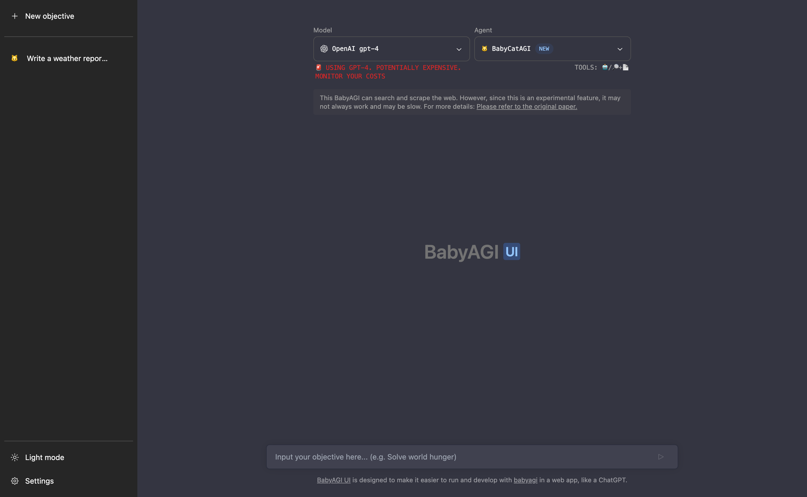

# 👶🤖🖥️ BabyAGI UI

BabyAGI UI is designed to make it easier to run and develop with [babyagi](https://github.com/yoheinakajima/babyagi) in a web app, like a ChatGPT.
This is a port of [babyagi](https://github.com/yoheinakajima/babyagi) with [Langchain.js](https://github.com/hwchase17/langchainjs) and build a user interface.


[Demo](https://twitter.com/miiura/status/1653026609606320130)

## 🧰 Stack

- [Next.js](https://nextjs.org/)
- [Pinecone](https://www.pinecone.io/)
- [LangChain.js](https://github.com/hwchase17/langchainjs)
- [Tailwind CSS](https://tailwindcss.com/)
- [Radix UI](https://www.radix-ui.com/)

## 🚗 Roadmap

- [x] The BabyAGI can search and scrape the web. ([🐝 BabyBeeAGI](https://twitter.com/yoheinakajima/status/1652732735344246784))
- [x] Exporting Execution Results
- [x] Execution history
- [x] Faster speeds and fewer errors. ([😺 BabyCatAGI](https://twitter.com/yoheinakajima/status/1657448504112091136))
- [ ] Display the current task and task list
- [x] i18n support
- [ ] User feedback
- [ ] Other LLM models support

and more ...

## 👉 Getting Started

1. Clone the repository

```sh
git clone https://github.com/miurla/babyagi-ui
```

2. Go to the project holder

```sh
cd babyagi-ui
```

3. Install packages with npm

```sh
npm install
```

4. Setup your .env file. And set the variables.
   - You need to create an index in advance with [Pinecone](https://www.pinecone.io/).
     - [Reference setting](./public/pinecone-setup.png)
   - Set your SerpAPI Key, if you want to use the search tool with BabyBeeAGI.

```sh
cp .env.example .env
```

5. Run the project

```sh
npm run dev
```

## 🚀 Deploy

### Vercel

Host your own live version of BabyAGI UI with Vercel.

[](https://vercel.com/new/clone?repository-url=https%3A%2F%2Fgithub.com%2Fmiurla%2Fbabyagi-ui)

## ⚠️ Warning

This script is designed to be run continuously as part of a task management system. Running this script continuously can result in high API usage, so please use it responsibly. Additionally, the script requires the OpenAI API to be set up correctly, so make sure you have set up the API before running the script.

[original](https://github.com/yoheinakajima/babyagi#warning)

## Credit

### BabyAGI

- Github: https://github.com/yoheinakajima/babyagi
- Author: [@yoheinakajima](https://github.com/yoheinakajima)
