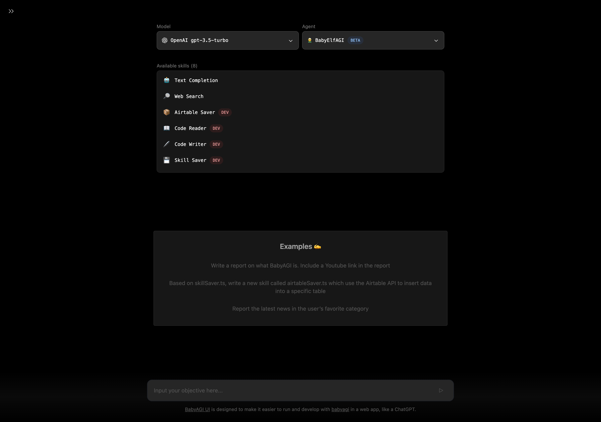

# 👶🤖🖥️ BabyAGI UI

BabyAGI UI is designed to make it easier to run and develop with [babyagi](https://github.com/yoheinakajima/babyagi) in a web app, like a ChatGPT. This is a port of [babyagi](https://github.com/yoheinakajima/babyagi) with [Langchain.js](https://github.com/hwchase17/langchainjs) and build a user interface.

[Demo](https://twitter.com/miiura/status/1653026609606320130)

## 💡 Get help

- [Discord](https://discord.gg/8nMD4X6RJm) 💬

## 🧰 Stack

- [Next.js](https://nextjs.org/)
- [Pinecone](https://www.pinecone.io/)
- [LangChain.js](https://github.com/hwchase17/langchainjs)
- [Tailwind CSS](https://tailwindcss.com/)
- [Radix UI](https://www.radix-ui.com/)

## 🚗 Roadmap

- [x] Collapsible Sidebar ⏩️

- [x] User input & parallel tasking. ([🦌 BabyDeerAGI](https://twitter.com/yoheinakajima/status/1666313838868992001))

- [x] API updates support (gpt-3.5-turbo-0613/gpt-3.5-turbo-16k-0613/gpt-4-0613)

- [x] Skills Class allows for easy skill creation ([🧝 BabyElfAGI](https://twitter.com/yoheinakajima/status/1678443482866933760))

- [x] Aggregate the logic of the agent in the backend.

- [x] Add hooks to make it easier to handle the agent on the frontend.

- [x] Support the OpenAI GPT-4 Turbo model

- [ ] Support the Llama2 model 🦙

and more ...

## 👉 Getting Started

1. Clone the repository

```sh
git clone https://github.com/miurla/babyagi-ui
```

1. Go to the project holder

```sh
cd babyagi-ui
```

1. Install packages with npm

```sh
npm install
```

1. Setup your .env file. And set the variables.
   - You need to create an index in advance with [Pinecone](https://www.pinecone.io/).
     - [Reference setting](./public/pinecone-setup.png)
   - Set your SerpAPI Key, if you want to use the search tool with BabyBeeAGI.

```sh
cp .env.example .env
```

1. Run the project

```sh
npm run dev
```

## 🚀 Deploy

### Vercel

Host your own live version of BabyAGI UI with Vercel.

## ⚠️ Warning

This script is designed to be run continuously as part of a task management system. Running this script continuously can result in high API usage, so please use it responsibly. Additionally, the script requires the OpenAI API to be set up correctly, so make sure you have set up the API before running the script.

[original](https://github.com/yoheinakajima/babyagi#warning)

## 🎗️ Official Sponsor

[&lt;img src="./public/images/serpapi-logo.svg" width=20% /&gt;](https://serpapi.com/)

- The SerpApi team is providing the search API credits for requests made on [the demo site](https://babyagi-ui.vercel.app/) of this project! ⭐️
- 🔍 [SerpApi](https://serpapi.com/): Scrape Google and other search engines from our fast, easy, and complete API.

## Credit

### BabyAGI

- Github: https://github.com/yoheinakajima/babyagi
- Author: [@yoheinakajima](https://github.com/yoheinakajima)
